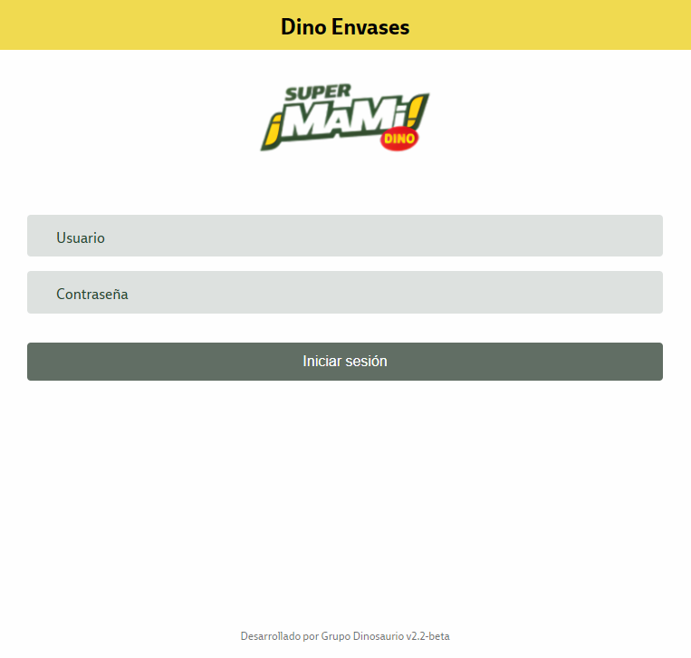
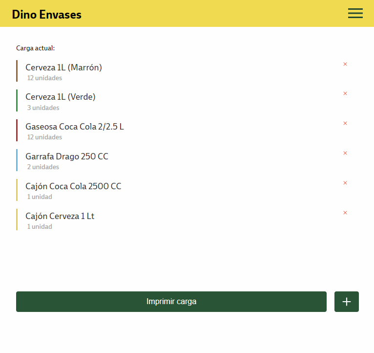

<header align="center">
  
  <h1 align="center">Dino Empleo - Dinosaurio RRHH</h1>
  
  
Portal de empleo oficial de Grupo Dinosaurio

 
</header>

<section align="center">

[Documentación](https://github.com/grupodinosaurio/DinoEnvases)
·
[Aplicación Web](https://www.dinosauriorrhh.com.ar/dinoenvases_test)
·
[Reportar Bug](https://github.com/grupodinosaurio/DinoEnvases/issues)
·
[Solicitar Feature](https://github.com/grupodinosaurio/DinoEnvases/issues)

</section>

<!-- TABLE OF CONTENTS -->

  
Indice de contenidos

  <ul>
    <li>
      <a href="#about-the-project">Sobre el Proyecto</a>
      <ul>
        <li><a href="#capturas">Capturas</a></li>
        <li><a href="#stack">Stack & Dependencias</a></li>
      </ul>
    </li>
    <li><a href="#install">Como iniciar</a></li>
    <li><a href="#contact">Contactos</a></li>
  </ul>

 
 

<section id="about-the-project">
  <h2>💼 Sobre el Proyecto</h2>

Dino Envases es una aplicación web, la cual trabaja en conjunto con una aplicación que funciona de intermediaria para impresiones de tickets por bluetooth.

Permite a los guardias del puesto 1(uno) `recepcionar envases de: Dragos, Cervezas, Gaseosas y sus cajones`; Para luego `imprimir un ticket` que debe ser entregado al cliente como vale, el mismo cuenta con un `EAN13 que puede ser utilizado en linea de caja`. 

 

<article id="capturas">

  <h3>📸 Capturas</h3>

 

</article>
  
 
  
<article id="stack">
  
  <h3>👾 Stack & Dependencias</h3>

| **Nombre**                    | **Versión** |
| ----------------------------- | ----------- |
|                               |             |
| @angular-devkit/build-angular | 17.0.7      |
| @angular-devkit/core          | 17.0.7      |
| @angular-devkit/schematics    | 17.0.7      |
| @angular/cli                  | 17.0.7      |
| @schematics/angular           | 17.0.7      |
| rxjs                          | 7.8.1       |
| typescript                    | 5.2.2       |
| zone.js                       | 0.14.2      |

</article>
  
 

</section>

<section id="install">
  <h2>💻 Como iniciar</h2>

<article>
  
  *Para el proyecto es necesario tener instalado NodeJs & npm*

  <pre>
  <code>
   $ git clone https://github.com/grupodinosaurio/DinoEnvases.git // Clone the repo
   
   $ git checkout front_dev // rama main del front
   
   $ npm install // Instalación de dependencias
  </code>
  </pre>

   
  
  El proyecto está estructurado de la siguiente forma:  
  
  <pre>
    + src
        + app
            + core
                + components
                + pages
            + shared
                + components
                + models
                + interceptors
                + services
  </pre>
  
En la carpeta `core/components` se van a encontrar los componentes correspondientes, dónde uno es el genéral *verificar el componente exportado en el módulo correspondiente* y el resto son componentes utilizados en el mismo.

En la carpeta `shared/models` se van a encontrar las interfaces, las cuales están modularizadas para las respuestas de servicios y/o variables.

En la carpeta `shared/interceptors` se van a encontrar los interceptores, encargados de ejecutar acciones antes, durante y/o después de una petición HTTP.

En la carpeta `shared/services` se van a encontrar servicios con responsabilidades divididas para cada acción.

   
   
   

Cómandos para desarrollo local

  <pre>
  <code>
  // Para cambiar las variables de entorno ingresar a 'src/environments'

   $ npm start // desarrollo local con API de testing

   $ npm run start-pwa // desarrollo local con un servidor virtual

   $ npm run build // build del proyecto listo para producción
  </code>
  </pre>

   
   
  
Para preparar el proyecto y subir a producción se deberá ejecutar el siguiente comando
  
  <pre>
  <code>
// 1. ingresar a la ruta `C:\inetpub\Web\dinosauriorrhh\dinoenvases_test` 
//    y mover todos los archivos, a la carpeta backup.
// 2. Ejecutar el comando de buildeo
// 3. Copiar el resultado de la carpeta 'dist/envases/browser'
// 4. Pegar en la ruta del servidor

// Recordar que cada vez que se actualiza la aplicación web se debe desinstalar
// la aplicación actual, ingresar a la web, borrar la caché e instalar nuevamente
  </code>
  </pre>
  
</article>
  
</section>

 
 

<section id="contact">
  <h2>🤝🏽 Contactos</h2>

<article>
  
  Participantes del proyecto:
  
  - Julio Rojas (Product Owner)
  - Marcelo Urriche (Scrum Master)
  - Cristian Sosa (Desarrollador)
  - Roberto Buttiero (Stackeholder)
  - Cristian Inverardi (Stackeholder)
  - Romina Burgos (Stackeholder)

</article>
  
</section>
